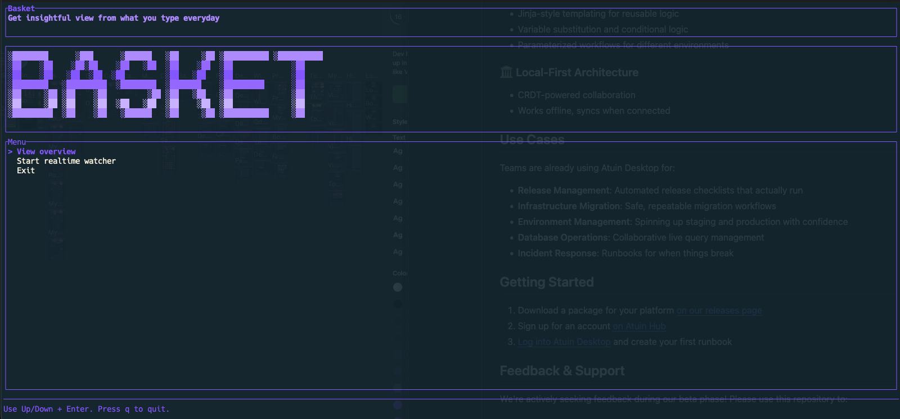
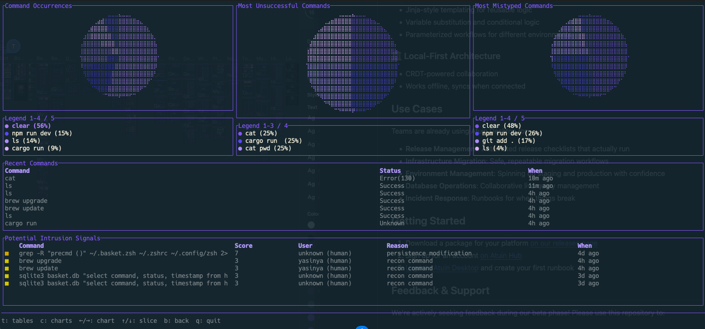
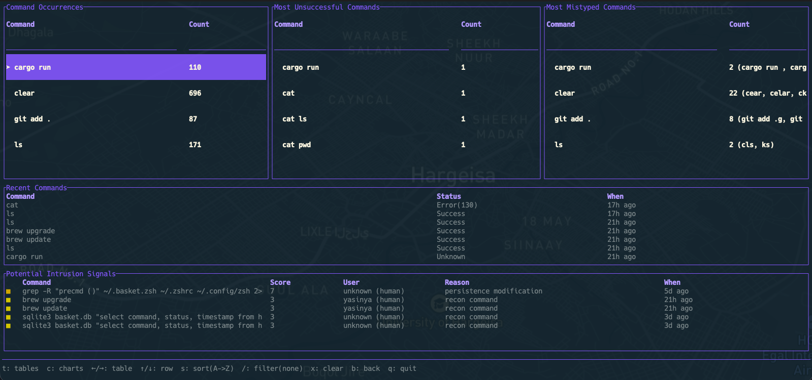

# Basket

[](https://github.com/YasinYA/basket/actions/workflows/ci.yml)
[](LICENSE)
[](https://crates.io/crates/basket)

Basket is a local TUI for understanding your shell history and spotting risky command patterns. It ingests your command history, shows overview analytics, and runs a lightweight rule-based IDS to flag suspicious activity with explanations.

## Highlights

- Interactive TUI: overview tables, charts, recent commands, and intrusion signals
- Realtime watcher: keep history streaming and dashboards fresh
- Rule-driven intrusion detection with score and reasons
- Local-only data: no network required

## Screenshots





## Quick Start

```bash
cargo run
```

## Installation

### Prerequisites

- Rust toolchain (stable)
- SQLite (bundled via `rusqlite`, no system install required)

### Build From Source

```bash
git clone <your-repo-url>
cd basket
cargo build --release
```

Binary will be at `target/release/basket`.

### Install via Cargo

```bash
cargo install --path .
```

Then run:

```bash
basket
```

### Run

```bash
./target/release/basket
```

## Controls

Menu:
- Up/Down: move
- Enter: select
- p: theme
- q: quit

Overview:
- t: tables
- c: charts
- Left/Right: switch table or chart
- Up/Down: move table row or chart slice
- s: sort (tables)
- /: filter (tables)
- x: clear filter
- p: theme
- b: back
- q: quit

Watcher:
- p: theme
- b: back
- q: quit

## IDS Rules (Rule-Driven)

Rules are defined in code and can be tuned via `ids_config.json`:

- `suppress_rules`: list of rule IDs to ignore
- `allowlist_commands`: substrings to ignore

Example:

```json
{
  "suppress_rules": ["recon.basic"],
  "allowlist_commands": ["kubectl", "terraform"]
}
```

## Data & Storage

- SQLite DB at `/Users/yasinya/basket.db`
- Command history from your shell history file
- Realtime ingest from `.cmdlog.json`

## Architecture

High-level flow:

1) Ingestion
- Historical import from shell history
- Realtime watcher from `.cmdlog.json`

2) Storage
- SQLite (`history` table)
- Includes timestamp, command, status, user

3) Analysis & IDS
- Overview analytics (top commands, mistypes)
- Rule-based IDS with sequence detection and scoring
- Tunable via `ids_config.json`

4) Presentation (TUI)
- Menu, overview dashboards, watcher status
- Recent commands and intrusion signals

## Screenshots / GIFs

Add screenshots or gifs here:
- `assets/overview.png`
- `assets/charts.gif`
- `assets/watcher.png`

## License

Apache-2.0. See `LICENSE` and `NOTICE`.
